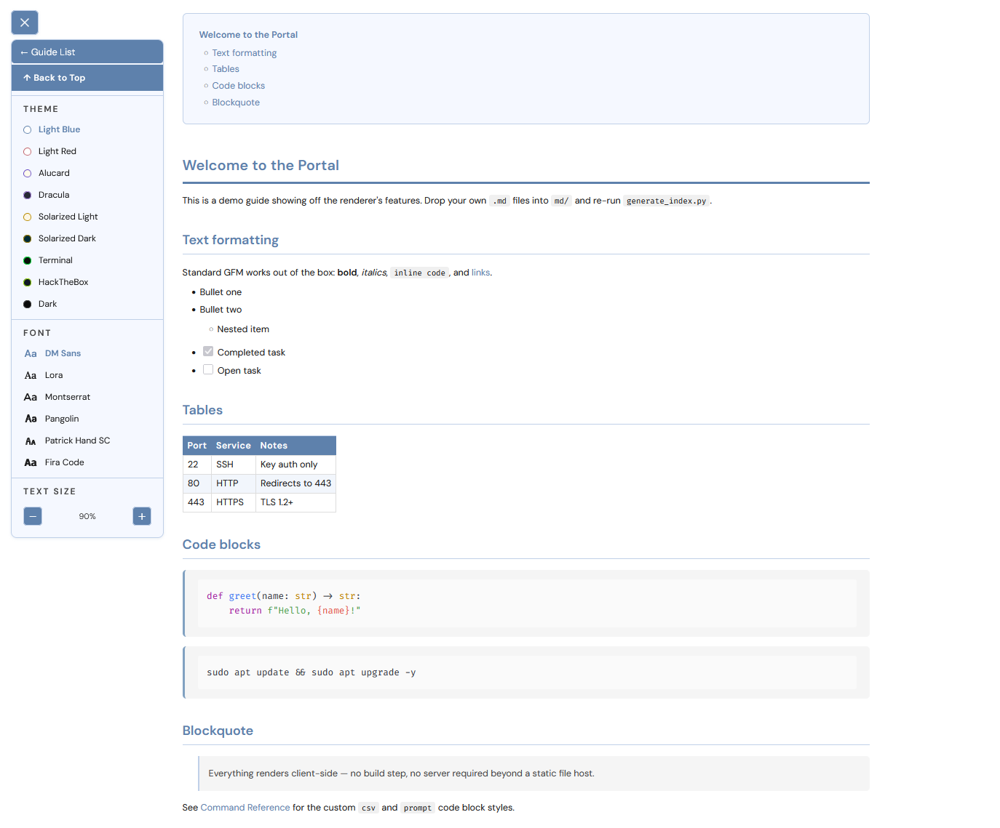

# Dynamic Revision Guide Portal

A single-file HTML portal that renders your Markdown guides in the browser with
theming, a table of contents, text scaling, syntax highlighting, and per-block
copy buttons. No build step - it parses `.md` files at runtime.



## Folder structure

```
guides/
├── index.html            <- the portal (open in browser)
├── generate_index.py     <- builds md/index.json
├── css/
│   ├── base.css          <- layout + shared styling (required)
│   ├── theme-light-blue.css
│   ├── theme-light-red.css
│   ├── theme-alucard.css
│   ├── theme-dracula.css
│   ├── theme-solarized-light.css
│   ├── theme-solarized-dark.css
│   ├── theme-terminal.css
│   ├── theme-dark.css
│   └── theme-hackthebox.css
└── md/
    ├── index.json        <- manifest (list of guides + tags)
    ├── CCSP_Revision_Guide_v5.md
    └── ...               <- any .md files, including subfolders
```

## Quick start

Eight sample guides are included in `md/` — `Welcome.md`,
`Command_Reference.md`, `Networking_Cheatsheet.md`,
`Linux_Privilege_Escalation.md`, `Windows_AD_Notes.md`,
`Web_App_Security_Cheatsheet.md`, and two under `Guides/`
(`Getting_Started.md`, `Theming_Guide.md`, to demo folder grouping) — so
you can see it running immediately, tags and all. Just
follow step 3 below. When you're ready to use your own content:

1. Drop your `.md` files into `md/` (subfolders are fine).
2. Build the manifest:

   ```bash
   python3 generate_index.py
   ```

   This scans `md/` recursively and writes `md/index.json`. Re-running it
   preserves any `tag` values you have already set.

3. Serve the folder and open it (a local server is the reliable option,
   because browsers block `fetch()` of local files over `file://`):

   ```bash
   python3 -m http.server 8080
   # then open http://localhost:8080/index.html
   ```

## The manifest (md/index.json)

`generate_index.py` writes an array of objects. Each guide has a `path`
(relative to `md/`) and an optional `tag` shown as a small badge on the index
page:

```json
[
  { "path": "CCSP_Revision_Guide_v5.md",     "tag": "(ISC)2" },
  { "path": "HTB/CPTS_Superguide.md",          "tag": "HTB" },
  { "path": "Reference/Defense_in_Depth.md",   "tag": "" }
]
```

Root-level guides are listed first, then subfolders. Sort order is natural, so
`v2` comes before `v10`. Edit the `tag` field by hand after generating; the next
run keeps your edits.

## Themes

Nine themes ship in `css/`, selectable from the controls panel and persisted via
`localStorage`: Light Blue, Light Red, Alucard, Dracula, Solarized Light,
Solarized Dark, Terminal, Dark, HackTheBox.

Each theme also picks a matching highlight.js colour scheme. To add a theme:

1. Copy an existing `css/theme-*.css` and adjust its CSS variables.
2. Add an entry to the `THEMES` object in `index.html` (`file` = the CSS path,
   `hljs` = a highlight.js style name). The style file has to exist under
   `vendor/hljs-styles/`, so download it there first; names under `base16/`
   keep that prefix, e.g. `base16/solarized-dark`.
3. Add a `<button class="theme-option" ...>` to the Theme controls block.

## Fonts and text size

Body font is switchable (DM Sans, Lora, Montserrat, Pangolin, Patrick Hand SC,
Fira Code); code always uses Fira Code. Text scales 50%-200%. Both persist
across sessions.

## Code blocks

Fenced code blocks are highlighted by highlight.js. Hovering a block shows a
Copy button that copies the raw text (handy for commands and snippets).

Supported languages out of the box:

| Fence         | Source                           |
| ------------- | -------------------------------- |
| `python`      | highlight.js (`vendor/`)         |
| `bash`        | highlight.js (`vendor/`)         |
| `powershell`  | highlight.js (`vendor/`)         |
| `csv` / `tsv` | custom (defined in `index.html`) |
| `prompt`      | custom (defined in `index.html`) |

Untagged blocks fall back to auto-detection across python/bash/powershell.

### `csv` blocks

Colours quoted fields, numbers, and the delimiters (`,` `;` tab). Example:

    ```csv
    name,port,service
    ssh,22,OpenSSH
    ```

### `prompt` blocks

For terminal/console sessions. The leading prompt is highlighted; the command
follows; lines with no prompt are treated as output and left plain. Recognised
prompts: `$`, `#`, `>`, `%`, `user@host:~$`, `PS C:\path>`, `C:\path>`.
A trailing `# comment` on a command line is dimmed.

    ```prompt
    user@kali:~$ nmap -sV 10.10.10.5   # quick scan
    22/tcp open ssh
    PS C:\Users\bud> Get-Process
    ```

## Adding a new language

Two cases.

1. highlight.js already ships it (sql, yaml, json, dockerfile, http, etc -
see https://highlightjs.org/download for the list). Download the language file
into `vendor/hljs-languages/` and add one script line to the `<head>` of
`index.html`, next to the existing language scripts:

   ```html
   <script src="vendor/hljs-languages/sql.min.js"></script>
   ```

   That is all - ` ```sql ` blocks now highlight. Do not point the tag at a CDN:
   the page's CSP only allows scripts from its own origin.

2. The language is not built in (like `csv` and `prompt` here). Register a
small grammar in the custom-languages `<script>` block in `index.html`:

   ```js
   hljs.registerLanguage('mylang', function() {
     return {
       name: 'MyLang',
       aliases: ['ml'],
       contains: [
         { scope: 'string',  begin: '"', end: '"' },
         { scope: 'number',  match: /\b\d+\b/ },
         { scope: 'keyword', match: /\b(if|then|else)\b/ },
         { scope: 'comment', begin: /#/, end: /$/ }
       ]
     };
   });
   ```

`scope` names map to highlight.js theme colours. The common ones - `keyword`,
`string`, `number`, `comment`, `meta`, `built_in`, `title`, `type`, `literal` -
are coloured by every theme. `punctuation` is not coloured by default, so the
portal adds a CSS rule for it (used by the `csv` delimiters); copy that pattern
if you introduce another uncoloured scope.

Grammar reference: https://highlightjs.readthedocs.io/en/latest/language-guide.html

## Notes

- Markdown parsing uses marked.js v9; standard GFM (tables, code, blockquotes,
  task lists) renders correctly.
- The TOC is auto-built from H1/H2 headings.
- Everything runs client-side and nothing is loaded from a CDN. marked,
  highlight.js (plus its language and style files), DOMPurify and the webfonts
  are all vendored under `vendor/` with their licences, so the portal works
  offline and makes no third-party requests.
- Rendered markdown is sanitised with `DOMPurify.sanitize(marked.parse(md))`
  before it reaches the DOM. A `.md` file is whatever someone dropped into
  `md/`, so inline HTML in it is treated as untrusted.
- `index.html` carries a Content-Security-Policy meta tag restricting scripts,
  styles and fonts to this origin. `img-src` allows `data:` and `blob:` only,
  so a markdown file referencing an image file on disk would need `'self'`
  adding to that directive.
